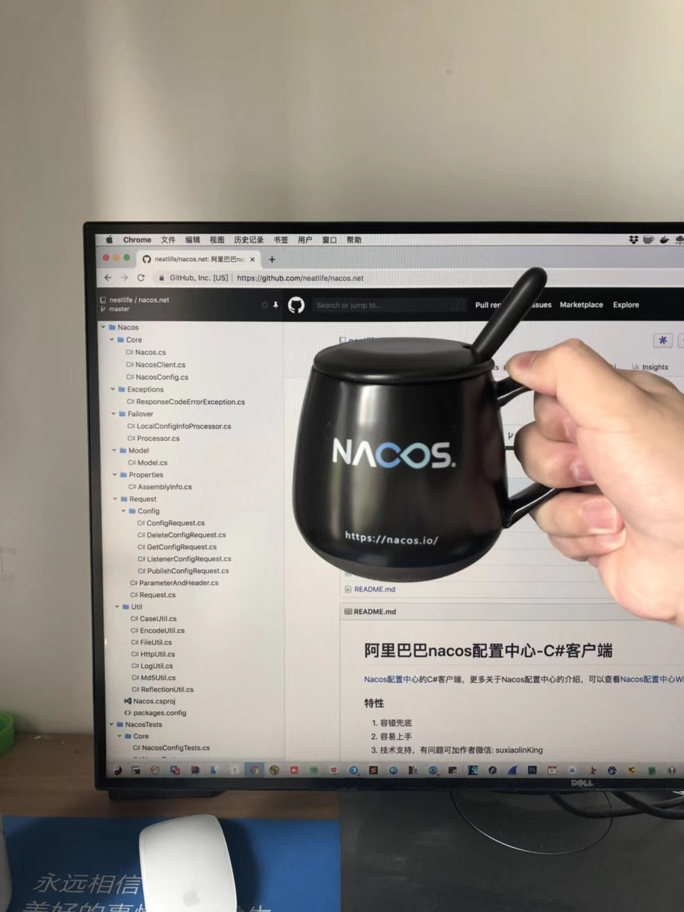
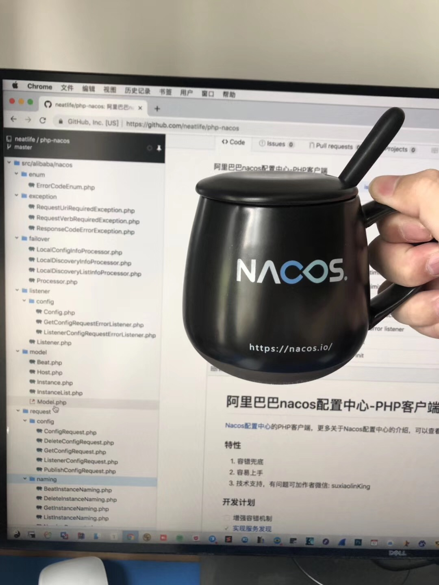

# 阿里巴巴nacos配置中心-PHP客户端

[Nacos配置中心](https://nacos.io/) 的PHP客户端，更多关于Nacos配置中心的介绍，可以查看 [Nacos文档](https://nacos.io/zh-cn/docs/what-is-nacos.html) 。

### 特性

1. 容错兜底
2. 容易上手
3. 技术支持，有问题可加作者微信: suxiaolinKing

### 开发计划

- [x] 增强容错机制
- [x] [实现服务发现](NAMING.md)
- [x] [Laravel框架集成](https://juejin.im/post/5ccf645b6fb9a032435dba16)
- [x] Dummy模式(本地开发不走配置中心)
- [x] 实现Nacos 2.0协议（配置部分）
- [ ] 实现Nacos 2.0协议（注册中心部分）
- [ ] Yii框架集成
- [ ] ThinkPHP框架集成
- [ ] Symfony框架集成

## composer安装

``` bash
composer require alibaba/nacos
```

## 主动获取配置内容

```php
use \com\alibaba\nacos\NacosFactory;
use \com\alibaba\nacos\api\PropertyKeyConst;

$properties = [
    PropertyKeyConst::SERVER_ADDR => 'mse-189af104-p.nacos-ans.mse.aliyuncs.com'
];
$cs = NacosFactory::createConfigService($properties);

$dataId = "dataId";
$group = "group";

$res = $cs->getConfig($dataId, $group, 5000);
```

## 使用crontab拉取配置文件

定时1分钟拉取一次

```bash
*/1 */1 * * * php path/to/cron.php
```

```php
# cron.php
Nacos::init(
    "http://127.0.0.1:8848/",
    "dev",
    "LARAVEL",
    "DEFAULT_GROUP",
    ""
)->runOnce();
```

拉取到的配置文件路径：当前工作目录/nacos/config/dev_nacos/snapshot/LARAVEL

配置文件保存的工作目录可以通过下面命令修改

```php
NacosConfig::setSnapshotPath("指定存放配置文件的目录路径");
```

## 长轮询拉取配置文件

```php
Nacos::init(
    "http://127.0.0.1:8848/",
    "dev",
    "LARAVEL",
    "DEFAULT_GROUP",
    ""
)->listener();
```

## 事件监听器

```php
GetConfigRequestErrorListener::add(function($config) {
    if (!$config->getConfig()) {
        echo "获取配置异常, 配置为空，下面进行自定义逻辑处理" . PHP_EOL;
        // 设置是否修改配置文件内容，如果修改成true，这里设置的配置文件内容将是最终获取到的配置文件
        $config->setChanged(true);
        $config->setConfig("hello");
    }
});
```

## 配置兜底方案

将兜底的配置文件放入下面的路径里

如果有给$tenant设置值，文件路径这样计算

工作目录/nacos/config/{$env}_nacos/config-data-{$tenant}/{$dataId}

否则

工作目录/nacos/config/{$env}_nacos/config-data/{$dataId}

nacos会在无法从配置中心查询配置文件时将读取上面的配置文件

## Dummy模式(本地开发不走配置中心)

配置环境变量NACOS_ENV=local再启动项目

```shell
export NACOS_ENV=local
```

## 贡献者 ✨


Thanks goes to these wonderful people:

<table>
  <tr>
    <td align="center">
      <a href="https://github.com/fatrbaby">
      <br /><sub><b>fatrbaby</b></sub></a><br />
      <a href="https://github.com/neatlife/php-nacos/commits?author=fatrbaby" title="Documentation">📖</a>
    </td>
    <td align="center">
      <a href="https://github.com/TELstatic">
      <br /><sub><b>TELstatic</b></sub></a><br />
      <a href="https://github.com/neatlife/php-nacos/commits?author=TELstatic" title="Documentation">📖</a>
    </td>
    <td align="center">
      <a href="https://github.com/wujunze">
      <br /><sub><b>wujunze</b></sub></a><br />
      <a href="https://github.com/neatlife/php-nacos/commits?author=wujunze" title="Documentation">📖</a>
    </td>
  </tr>
</table>

Contributions of any kind are welcome!

## 感谢nacos团队赠送的纪念杯



